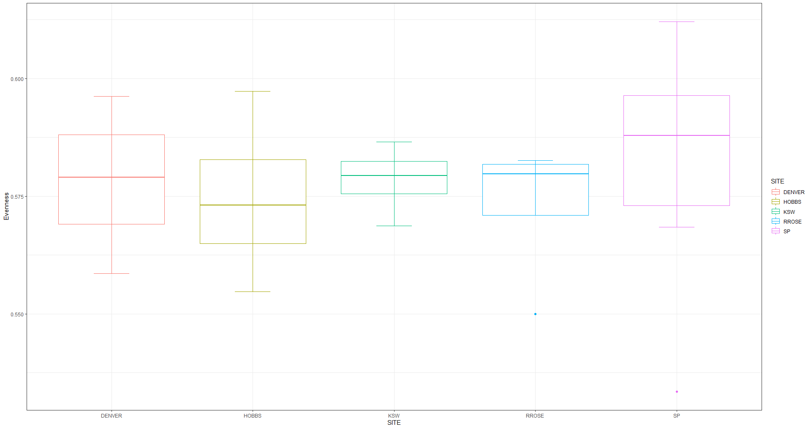
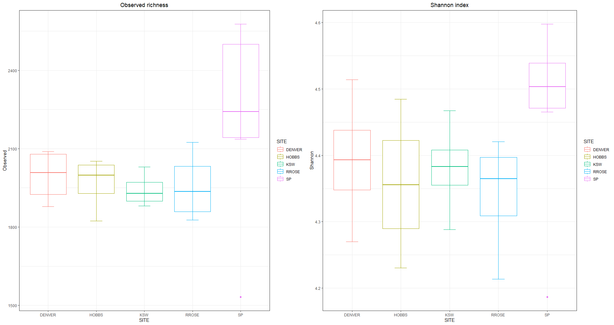
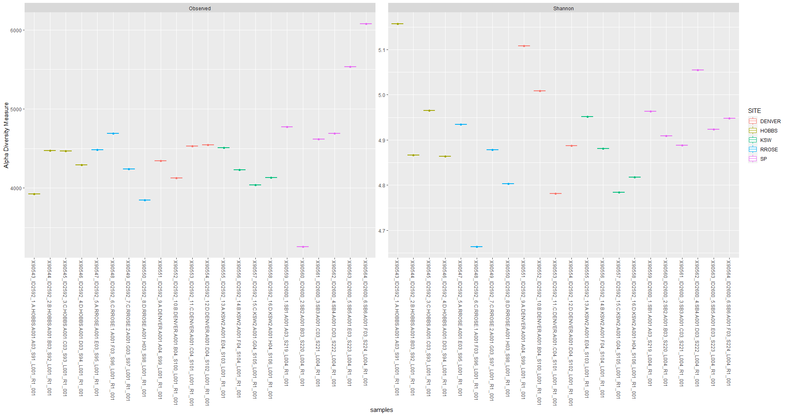

# Soil microbiome analysis

This folder contains the result of a bioinformatics analysis to determine the biodiversity of a soil sample. In each of the subfolders, you will find the code associated with the specific analysis that was performed (alpha diversity, beta diversity, comparisons between soil samples and OTU's that were found). Likewise, within each subfolder, you can also find the graphs obtained after the analysis was performed.

All the R files have comments in the lines of code that explain what it does, although it is possible that it is not very explanatory nor very ordered, since it was the first time that I made an analysis with R. Thus, as it was a temporary work in a Spanish company, a good part of the code, as well as the comments are in Spanish.

